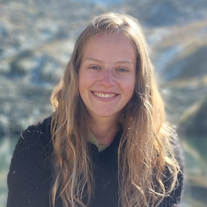

# AI4ER Guided Team Challenge 2024

 

## Project Description

**TODO: fill this section in!**

## Environment Setup

**TODO: clean this section up and make sure instructions work from scratch!**

1. Clone this repository using `git clone --recursive <HTTPS or SSH>` to ensure the ECCO submodule is loaded as well.
2. Edit the `environment.yml` file to include your own local filepath for your conda environments. See comment in file for further instructions.
3. Create your conda python environment using `conda env create -f environment.yml` and activate the environment with `conda activate gtc`.
4. Make sure you can run the first cell of `sandbox.ipynb`--this ensures that the ECCO package is loaded correctly and all dependencies have been installed to your python environment. If using VSCode, be sure to set your kernel to the `gtc` conda environment.

## Repository Overview

**TODO: fill this section in with descriptions of individual files!**

Many directories containn an `archive/` sub-directory, which contains code that was produced during the project, but is not needed to reproduce our final analysis. Many of these archived files are well-commented or self-explanatory, but given their secondary nature we do not describe them in the same level of detail in this overview.

### `scripts/`

This directory contains all Python scripts used for data download and preprocessing.

- `basin_masks.py`:
- `download_ecco.py`:
- `ecco_download.py`:
- `streamfunction_latlon.py`:

### `models/`

This directory contains all machine learning model definitions (mostly different forms of neural networks), PyTorch dataset class definitions, model training loops, and utility functions for use during modelling.

**Model definitions:**
- `MLP.py`:
- `SOLODOCH.py`:
- `CNN1D.py`:
- `CNN2D.py`:
- `CNN3D.py`:
- `CNN_RAPID.py`:
- `ESN.py`

**PyTorch dataset definitions:**
- `RAPIDDataset`:
- `SimDataset.py`:

**Utility functions:**
- `utils.py`:
- `plotting_utils.py`:

**Model training loops:**
- `train.py`:
- `train_alt.py`:

### `notebooks/`

This directory contains all of our major data processing and all modelling experiments for ECCO.

**Data processing & exploration:**
- `streamfunction/`:
- `moc/`:

**Linear regression experiments:**
- `linear_regression.ipynb`:
- `latitude_transfer_linear_regression`:

**CNN experiments:**
- `neural_networks.ipynb`:

**RAPID experiments:**
- `RAPID_transfer_linear_regression.ipynb`:
- `RAPID_transfer_neural_network.ipynb`:

### `ACCESS/`

This directory contains all major data processing and all modelling experiments for ACCESS. Much of this code can be found elsewhere in the repository, but we choose to leave this in its own directory since it is a substantial extension.

**Found elsewhere in repo:**
- `MLP.py`:
- `ESN.py`:
- `SimDataset.py`:
- `plotting_utils.py`:
- `utils.py`:
- `train.py`:

**Unique to ACCESS:**
- `data_retrieval.ipynb`:
- `models.ipynb`:

## Acknowledgements

We would like to thank our faculty supervisors--Ali Mashayek, Laura Cimoli, and Alberto Naveira Garabato--as well as our project mentors--Josh Lanham and Kate Oglethorpe. Their guidance throughout was instrumental in our success as a team. We would also like to thank the AI4ER support staff--Annabelle Scott and Adriana Dote--for their help navigating the complex logistics of the Guided Team Challenge.

-----

## Team Members

<table>
  <tr>
    <td></td>
    <td><a href="mailto:ngb34@cam.ac.uk">Nina Baranduin</a></td>
    <td></td>
    <td><a href="mailto:tc656@cam.ac.uk">Tom Cowperthwaite</a></td>
    <td></td>
    <td><a href="mailto:el590@cam.ac.uk">Emilio Luz-Ricca</a></td>
  </tr>
  <tr>
    <td></td>
    <td><a href="mailto:sm2783@cam.ac.uk">Sharan Maiya</a></td>
     <td></td>
    <td><a href="mailto:av656@cam.ac.uk">Aline Van Driessche</a></td>
  </tr>

</table>

-----

## License and Citation

If you use the code in this repository, please consider citing it--see the [`citation.cff`](citation.cff) file or use the "Cite this repository" function on the right sidebar. All code is under the MIT license--see the [`LICENSE`](LICENSE) file.

## Data Availability

**TODO: fill this section in!**

-----

  
  

