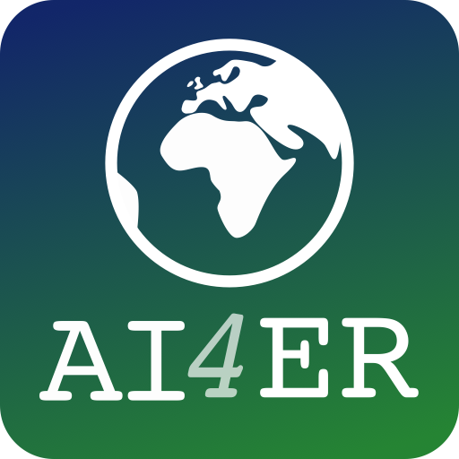

# AI4ER Guided Team Challenge 2024

 

## Overview

## Repository Setup

1. Clone this repository using `git clone --recursive <HTTPS or SSH>` to ensure the ECCO submodule is loaded as well.
2. Edit the `environment.yml` file to include your own local filepath for your conda environments. See comment in file for further instructions.
3. Create your conda python environment using `conda env create -f environment.yml` and activate the environment with `conda activate gtc`.
4. Make sure you can run the first cell of `sandbox.ipynb`--this ensures that the ECCO package is loaded correctly and all dependencies have been installed to your python environment. If using VSCode, be sure to set your kernel to the `gtc` conda environment.

## Acknowledgements

We would like to thank our faculty supervisors--Ali Mashayek, Laura Cimoli, and Alberto Naveira Garabato--as well as our project mentors--Josh Lanham and Kate Oglethorpe. Their guidance throughout was instrumental in our success as a team. We would also like to thank the AI4ER support staff--Annabelle Scott and Adriana Dote--for their help navigating the complex logistics of the Guided Team Challenge.

-----

## Team Members

<table>
  <tr>
    <td></td>
    <td><a href="mailto:ngb34@cam.ac.uk">Nina Baranduin</a></td>
    <td></td>
    <td><a href="mailto:tc656@cam.ac.uk">Tom Cowperthwaite</a></td>
    <td></td>
    <td><a href="mailto:el590@cam.ac.uk">Emilio Luz-Ricca</a></td>
  </tr>
  <tr>
    <td></td>
    <td><a href="mailto:sm2783@cam.ac.uk">Sharan Maiya</a></td>
     <td></td>
    <td><a href="mailto:av656@cam.ac.uk">Aline Van Driessche</a></td>
  </tr>

</table>

-----

## License and Citation

If you use the code in this repository, please consider citing it--see the [`citation.cff`](citation.cff) file or use the "Cite this repository" function on the right sidebar. All code is under the MIT license--see the [`LICENSE`](LICENSE) file.

## Data Availability

-----

  
  

